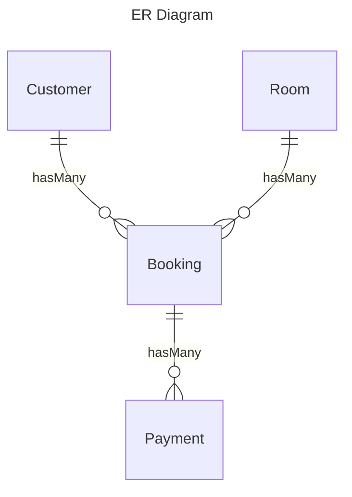

<p align="center"><a href="https://laravel.com" target="_blank"></a></p>

<p align="center">
<a href="https://github.com/laravel/framework/actions"></a>
<a href="https://packagist.org/packages/laravel/framework"></a>
<a href="https://packagist.org/packages/laravel/framework"></a>
<a href="https://packagist.org/packages/laravel/framework"></a>
</p>

# Project Readme



## Technologies Used

1. **Laravel**: The web application is built on the Laravel PHP framework, providing a robust and modern foundation for web development.

2. **Laravel Sail**: Laravel Sail is used for local development environment setup, providing a lightweight Docker setup for Laravel applications.

3. **Sanctum**: Laravel Sanctum is employed for API authentication, offering a simple and lightweight solution for token-based authentication.

4. **[Mailtrap](https://mailtrap.io/?gad_source=1)**: Mailtrap is utilized for testing email functionalities within the application, ensuring that email creation and booking cancellation workflows are working as expected.

5. **Laravel Event and Listener System**: Laravel's event and listener system is implemented to create a notification system via email. This system allows the application to trigger and handle events asynchronously.

6. **[rakutentech/laravel-request-docs](https://github.com/rakutentech/laravel-request-docs)**: This package is integrated into the project for generating API documentation. It helps in maintaining clear and up-to-date documentation for API endpoints.

7. **Task Scheduling**: Laravel Scheduler is used to schedule jobs for checking room statuses. This ensures that the system can perform automated tasks at specified intervals.

8. **PHPUnit**: PHPUnit is used for writing and running unit tests to ensure the functionality of various API endpoints. This helps in maintaining code quality and catching issues early in the development process.

9. **[mermaid.js](https://mermaid.js.org/)**: mermaid.js is utilized to create an Entity Relationship (ER) diagram representing the relationships between various models in the application.

## Getting Started

Follow the steps below to set up the project locally:

1. Clone the repository: `git clone <repository-url>`
2. Set up the environment: Configure the `.env` file with appropriate settings.
3. Run Sail: `./vendor/bin/sail up`
4. Run migrations: `./vendor/bin/sail artisan migrate`
5. Seed the database (if needed): `./vendor/bin/sail artisan migrate --seed`
6. Start the cronjob for scheduler: `./vendor/bin/sail artisan schedule:work`

## API Documentation

The API documentation can be found using the `rakutentech/laravel-request-docs` package. Access the documentation by running the server and visiting the specified endpoint.
[Link for documentation](http://localhost/request-docs)

## Testing

Run PHPUnit tests to ensure the correctness of the implemented functionalities:

```bash
sail test
